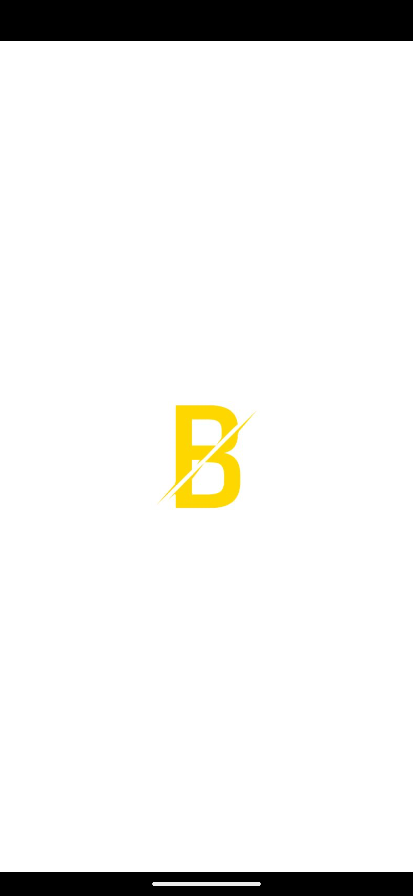
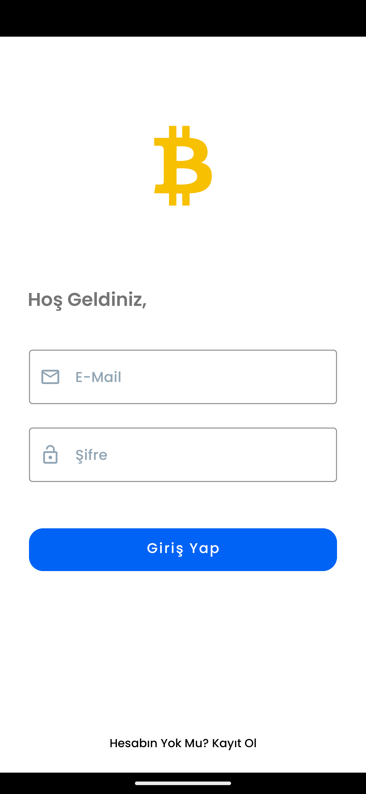
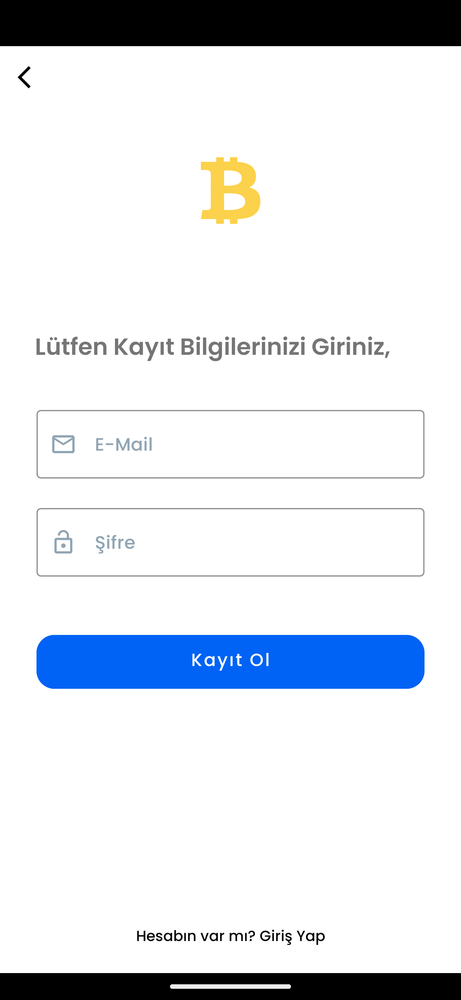
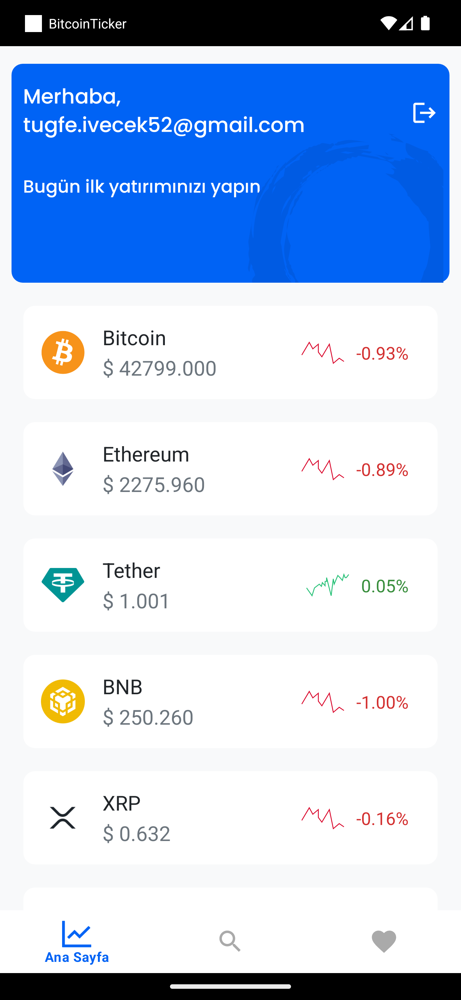
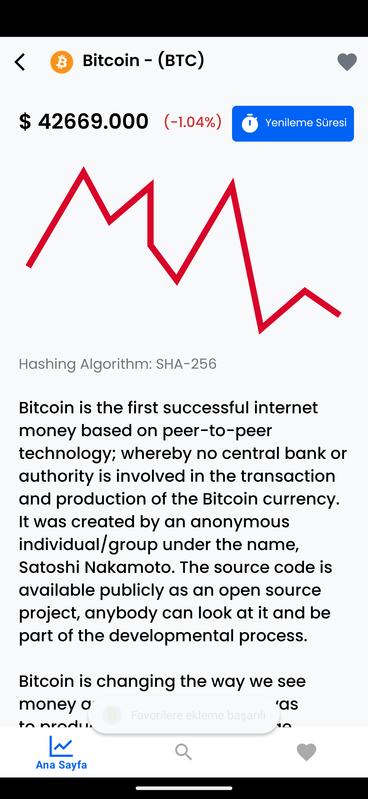
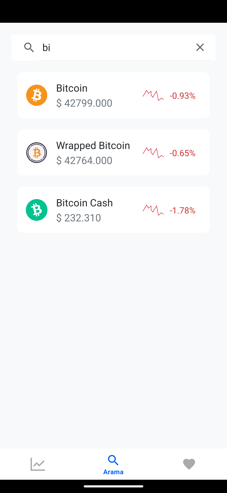

# BitcoinTicker

## A Simple Cryptocurrency Price Tracker App

   

# 📍Kotlin Language Based on Clean + MVVM Structure

- Kotlin Version : 1.8.0
- Min SDK Version : 29 (Android 10.0)
- [API Link](https://www.coingecko.com/en/api)

## 📍Important Libraries in BitcoinTicker App

|Library Name   |Version Number          |
|---------------|------------------------|
|Retrofit		 |2.9.0                   |
|Hilt      |2.42 					|
|WorkManager			 |2.7.0 					|
|ScreenSize (Sdp-Ssp)		 |1.1.0				|
|Multidex	 |2.0.1				|
|Navigation	 |2.5.3			|
|Lottie	 |3.4.0		|
|Glide	 |4.13.1		|

## 📍Gradle Dependencies

- MVVM with Clean Architecture
- Hilt
- Retrofit
- Glide
- Coroutines & Flow
- Navigation Components
- WorkManager
- Notification
- FirebaseAuth
- FirebaseFirestore
- FirebaseCrashlytics

## 📍Screens
-----------

# Splash Screen

# Login Screen

# Register Screen

# Home Screen

# Coin Detail Screen

# Search Screen

# Favorite Screen

## 📍MVVM Architecture ,useful links and resources

[Android Architecture](https://github.com/googlesamples/android-architecture)

[Android Jetpack](https://github.com/androidx)

[Kotlin Hilt](https://developer.android.com/training/dependency-injection/hilt-android)

[Android - Clean Architecture - Kotlin](https://github.com/android10/Android-CleanArchitecture-Kotlin)